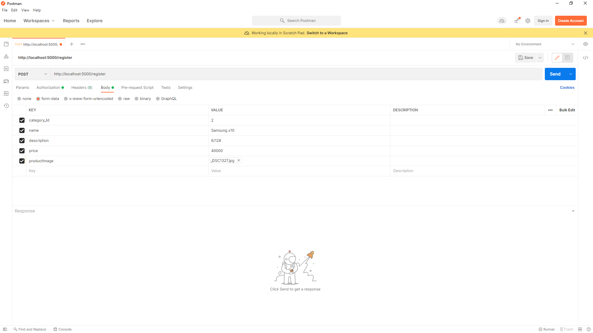

# “Insert product and Place Order” System for an E-commerce website.

A brief description to get all response as a json object

## Packages used

    npm i express jsonwebtoken bcryptjs multer pg

## Connect with database

    const Pool = require("pg").Pool;

    const pool = new Pool({
        user: "postgres",
        password: "123456",
        database: "postgres",
        host: "localhost",
        port: 3600, //default 5432
    });

## API Reference

#### Register an user

```http
  POST : /register
```

- For register an user need to pass this parameters

  name,email,password,gender,age

- Or pass it like a json object with postman Body

        {
            "name":"example",
            "email":"example@example.com",
            "password":"example",
            "gender":"male",
            "age":25,
        }

#### Login an user

```http
   POST : /login
```

- For register an user need to pass this parameters

  email,password

- Or pass it like a json object with postman Body

        {
            "email":"example@example.com",
            "password":"example"
        }

#### Insert Product Category

```http
   POST : /productCategory
```

- For register an user need to pass this parameters

  categoryname, categorydescription

- Or pass it like a json object with postman Body

        {
            "categoryname":"mobile",
            "categorydescription":"All Brands available"
        }

#### Get all Product Category

```http
   GET : /productCategory
```

### Insert Products

```http
   POST : /product
```

- For register an user need to pass this parameters

        category_Id, name, description, price

- Also upload a image file for productImage

  #### Image will be store as a buffer data

- Or pass it like a form-data with postman Body

  

### Get all Products

```http
   GET : /product
```

### place an order

```http
   POST : /product/:id
```

- For register an user need to pass product id as a params

      /product/productId

- Also need to pass a verified token by params or as a json object postman Body

  #### This token used to authenticate an user whether user is logged in or not.

        {
            "token":"token"
        }

### Get all orders

```http
   GET : /orderedlist
```

- Need to pass a verified token by params or as a json object postman Body

  #### This token used to authenticate an user whether user is logged in or not.

        {
            "token":"token"
        }
